# Cyber Intelligence → ATT&CK → Defensive Design Journal

A weekly, threat-informed security engineering journal that converts real-world cyber incidents into **MITRE ATT&CK techniques**, **defensive controls**, and **actionable design requirements**—especially for **enterprise and isolated mission systems**.

---

## How This Project Works

This project follows a repeatable workflow that turns cyber incident reporting into concrete defensive architecture guidance.

```mermaid
flowchart TD
    A[Cyber Incidents & Threat News]
    B[MITRE ATT&CK<br/>Technique Spine]
    C[Defensive Controls<br/>Prevent · Detect · Contain · Recover]
    D[Design Requirements<br/>& Architecture]

    A --> B
    B --> C
    C --> D
```

## 🔍 Intelligence Sources for Weekly Reviews

This journal prioritizes **high-signal sources** that provide technical depth, operational relevance, and authoritative attribution.  
The goal is not to track every breach, but to focus on incidents that introduce **new techniques, trust failures, or systemic risk**.

---

### Primary Sources (High-Signal, Long-Form Analysis)

- **WIRED – Security**
  - https://www.wired.com/tag/security/
  - Investigative reporting and deep incident narratives

- **The Record (Recorded Future News)**
  - https://therecord.media/
  - Straightforward reporting on major cyber incidents and policy

- **Krebs on Security**
  - https://krebsonsecurity.com/
  - Infrastructure, cybercrime, and ecosystem-level analysis

---

### Government & Authoritative Advisories

- **CISA Cybersecurity Advisories**
  - https://www.cisa.gov/news-events/cybersecurity-advisories
  - Alerts, advisories, and confirmed exploitation guidance

- **CISA Known Exploited Vulnerabilities (KEV) Catalog**
  - https://www.cisa.gov/known-exploited-vulnerabilities-catalog
  - Vulnerabilities confirmed to be exploited in the wild

- **US-CERT**
  - https://www.cisa.gov/uscert
  - Incident response coordination and guidance

---

### Technical & Vendor Threat Research

Used for **technique validation and MITRE ATT&CK mapping**, not marketing.

- **Mandiant Research**
  - https://www.mandiant.com/resources/blog
  - Incident response and adversary tradecraft analysis

- **CrowdStrike Blog**
  - https://www.crowdstrike.com/blog/
  - Adversary behavior and campaign analysis

- **Microsoft Security Response Center (MSRC)**
  - https://msrc.microsoft.com/blog/
  - Patch context, exploit analysis, and vulnerability response

- **Cisco Talos Intelligence**
  - https://blog.talosintelligence.com/
  - Network-centric threat research and malware analysis

---

### Daily / Early Signal Monitoring

Used to identify **emerging activity**, not as final authority.

- **SANS Internet Storm Center (ISC)**
  - https://isc.sans.edu/
  - Daily threat observations and early warnings

- **GreyNoise Blog**
  - https://www.greynoise.io/blog
  - Internet-wide scanning activity and noise analysis

---

### How These Sources Are Used

- **News sources** identify *what happened*
- **Government advisories** confirm *severity and exploitation*
- **Technical research** explains *how it worked*
- **This journal** determines *what would have prevented or contained it*

---

### Selection Criteria for Weekly Entries

An incident is included if it demonstrates one or more of the following:

- A new or impactful **MITRE ATT&CK technique**
- A failure of **trusted update, identity, or segmentation assumptions**
- **Wormable, supply-chain, or destructive behavior**
- Lessons that translate directly into **defensive design requirements**
